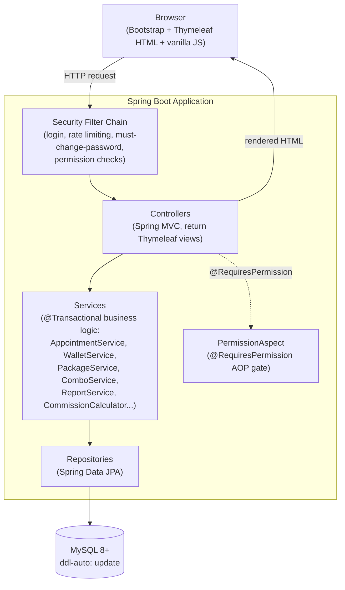
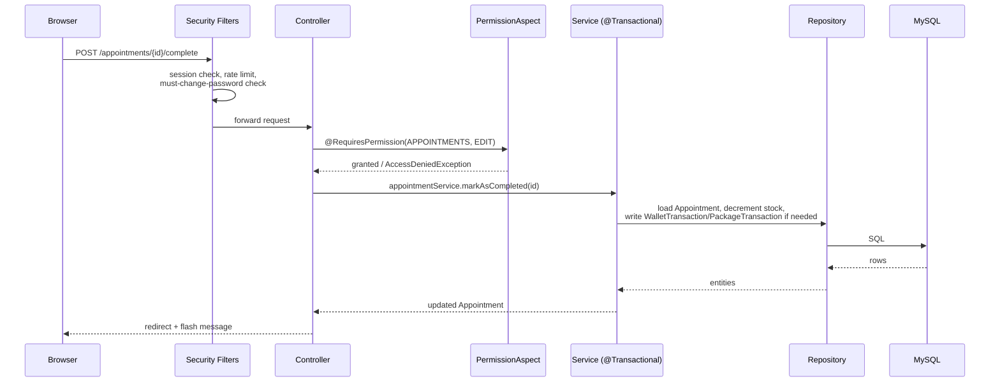
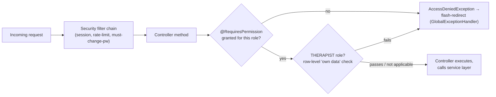
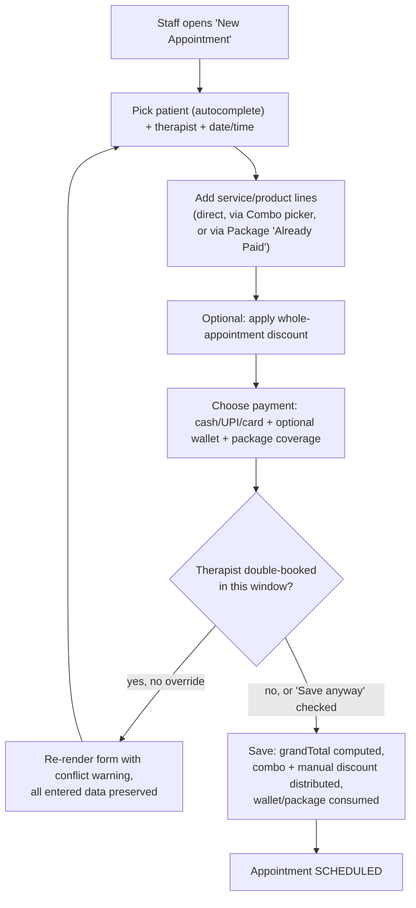
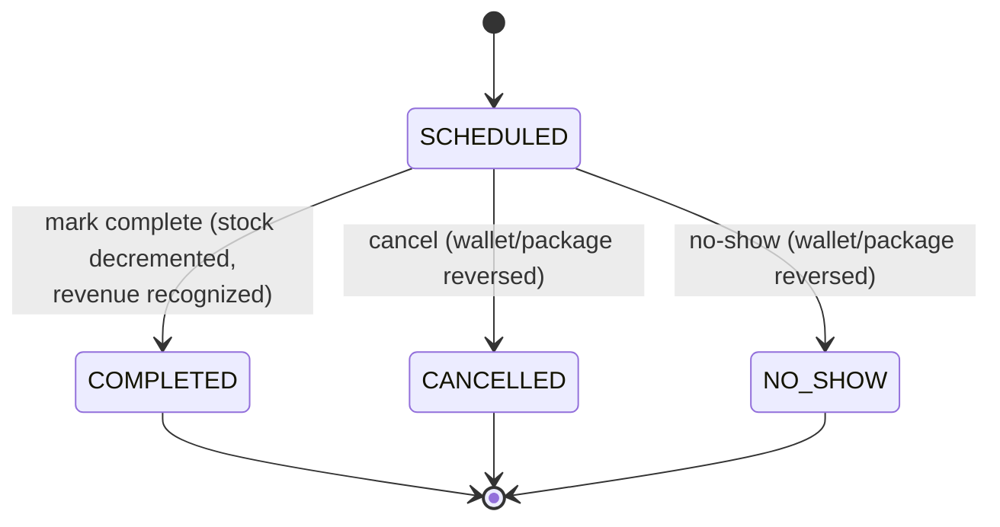
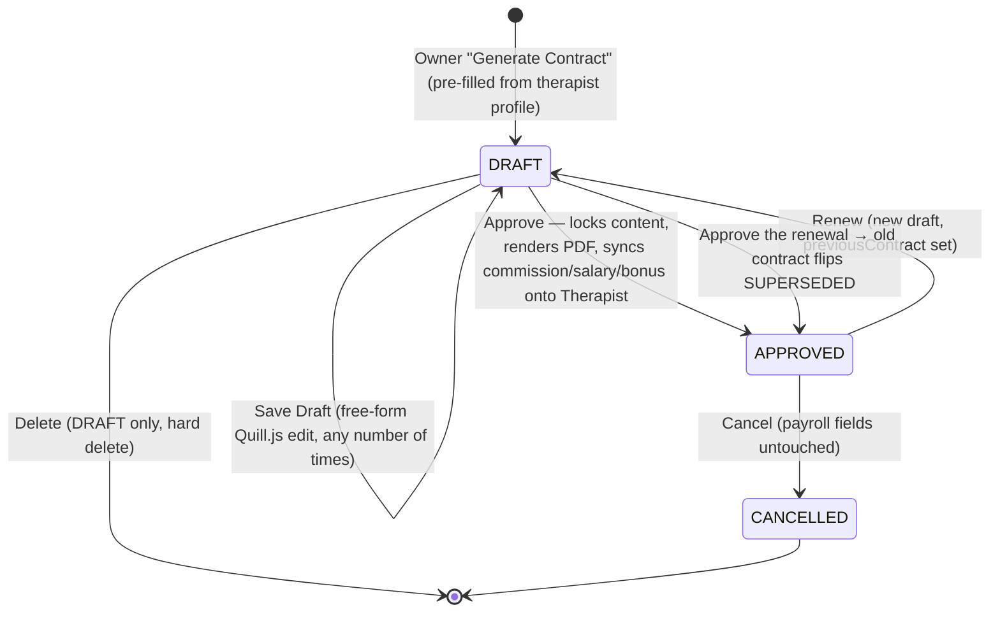

# Healing House — Clinic Management System

A web application for running the day-to-day operations of a physiotherapy/wellness clinic: patients, therapists, appointments, services, products, combos, prepaid packages, wallets, discounts, commissions, and reporting — all behind role-based login.

Built with **Spring Boot 4 + Thymeleaf + MySQL**, server-rendered (no SPA/JS build step), designed to be run by a small clinic team (owner, admin/reception staff, therapists).

---

## Table of Contents

1. [What this application does](#what-this-application-does)
2. [Tech stack](#tech-stack)
3. [Architecture](#architecture)
4. [Domain model](#domain-model)
5. [Roles & permissions](#roles--permissions)
6. [Core workflows](#core-workflows)
7. [Money & payment sources](#money--payment-sources)
8. [Project structure](#project-structure)
9. [Getting started](#getting-started)
10. [Configuration & profiles](#configuration--profiles)
11. [Deployment](#deployment)
12. [Reports](#reports)
13. [Testing](#testing)
14. [Where to look next](#where-to-look-next)

---

## What this application does

Healing House Clinic runs on a simple loop: a **patient** books an **appointment** with a **therapist** for one or more **services**/**products**. The appointment is priced, discounted, paid for (cash, UPI, card, wallet, or a prepaid package), and — once marked complete — feeds commission and revenue reports for the clinic owner.

Everything else in the system exists to support that loop:

- **Catalog** — services, products, tags (for categorization + commission eligibility), combos (bundled discount offers), and package templates (multi-session bundles).
- **Money** — per-appointment discounts, a patient wallet (prepaid ₹ balance), and prepaid session packages — three independent ways a patient can pay, all reconciled against the same `grandTotal`.
- **Costs** — one-off and recurring clinic expenses (rent, salaries, supplies) against an admin-managed category list, netted against revenue in a Profit & Loss report.
- **Scheduling** — a per-therapist calendar and an all-therapists overlay calendar, with drag-to-reschedule, conflict warnings (not hard blocks), and duration tracking.
- **Payroll input** — therapist commission is computed from tagged, completed appointment lines, per line-item therapist (not just the main therapist on the appointment).
- **Employment Contracts** — the Owner generates a branded PDF employment contract per therapist (salary, commission %, bonus, probation, notice period), free-form reviews/edits it, then approves it — locking the content, rendering the PDF, and syncing those terms onto the therapist's live payroll fields.
- **Reporting** — seven report types (daily, period, comparison, patient acquisition, performance, actual revenue, profit & loss) each exportable to CSV/PDF.
- **Security** — session-based login, five fixed roles, a data-driven permission matrix, and therapist "own data only" scoping (plus a short-lived password re-confirmation before a therapist can view their own earnings page).

---

## Tech stack

| Layer | Technology |
|---|---|
| Language / runtime | Java 21 |
| Framework | Spring Boot 4.1 (Web MVC, Data JPA, Security, Validation, AspectJ, Scheduling) |
| View layer | Thymeleaf (server-rendered HTML, no client framework) |
| Frontend | Bootstrap 5.3 (CDN), vanilla JS, Chart.js (CDN), FullCalendar v6 (CDN) — **no npm/node build step** |
| Database | MySQL 8+ (Hibernate `ddl-auto: update`, no migration tool yet) |
| Auth | Spring Security — session/form login, BCrypt passwords |
| Exports | OpenCSV (CSV), iText 7 (branded PDF reports), iText `html2pdf` (rich-text contract PDFs) |
| Rich text | Quill.js (CDN) — employment contract free-form editor |
| Build | Maven (`mvnw`), `maven-assembly-plugin` produces a deployable zip |
| Boilerplate | Lombok (`@Data`, `@Builder`, etc.) |

---

## Architecture

Classic layered Spring MVC — no microservices, no message queue, one deployable jar per environment.



Request lifecycle, start to finish:



**Layer responsibilities:**

- `entity/` — JPA entities + enums (the persisted domain model)
- `repository/` — Spring Data JPA interfaces, plus `Specification`-based dynamic queries (`AppointmentSpec`)
- `service/` — all business logic and `@Transactional` boundaries; controllers never touch the database directly
- `controller/` — thin Spring MVC controllers; bind forms, call one service method, return a view name or redirect
- `dto/` — form-binding objects (`AppointmentForm`) and read-only report projections (`DailyReportDTO`, etc.)
- `security/` — Spring Security wiring: user details, permission service/aspect, login rate limiting, forced password change
- `config/` — startup seeding (`DataSeeder`, `SecuritySeeder`), one-time data backfills, app-wide config beans
- `util/` — formatters, CSV/PDF export helpers, the shared proportional-split allocator, safe-redirect sanitizer

---

## Domain model

```mermaid
erDiagram
    PATIENT ||--o{ APPOINTMENT : books
    THERAPIST ||--o{ APPOINTMENT : "assigned as main"
    APPOINTMENT ||--o{ APPOINTMENT_SERVICE_LINE : contains
    APPOINTMENT ||--o{ APPOINTMENT_PRODUCT_LINE : contains
    CLINIC_SERVICE ||--o{ APPOINTMENT_SERVICE_LINE : "priced at booking"
    PRODUCT ||--o{ APPOINTMENT_PRODUCT_LINE : "priced at booking"
    THERAPIST ||--o{ APPOINTMENT_SERVICE_LINE : "per-line therapist"
    THERAPIST ||--o{ APPOINTMENT_PRODUCT_LINE : "per-line therapist"

    TAG }o--o{ CLINIC_SERVICE : tags
    TAG }o--o{ PRODUCT : tags

    COMBO ||--o{ COMBO_SERVICE_ITEM : bundles
    COMBO ||--o{ COMBO_PRODUCT_ITEM : bundles
    APPOINTMENT ||--o{ APPOINTMENT_COMBO : "combo applied"
    APPOINTMENT_SERVICE_LINE }o--|| APPOINTMENT_COMBO : "belongs to (nullable)"
    APPOINTMENT_PRODUCT_LINE }o--|| APPOINTMENT_COMBO : "belongs to (nullable)"

    PACKAGE_TEMPLATE ||--o{ PACKAGE_TEMPLATE_SERVICE_ITEM : defines
    PACKAGE_TEMPLATE ||--o{ PACKAGE_TEMPLATE_PRODUCT_ITEM : defines
    PATIENT ||--o{ PATIENT_PACKAGE : owns
    PACKAGE_TEMPLATE ||--o{ PATIENT_PACKAGE : "sold from (optional)"
    PATIENT_PACKAGE ||--o{ PATIENT_PACKAGE_SERVICE_ITEM : contains
    PATIENT_PACKAGE ||--o{ PATIENT_PACKAGE_PRODUCT_ITEM : contains
    PATIENT_PACKAGE ||--o{ PACKAGE_TRANSACTION : logs
    APPOINTMENT_SERVICE_LINE }o--|| PATIENT_PACKAGE_SERVICE_ITEM : "consumed from (nullable)"
    APPOINTMENT_PRODUCT_LINE }o--|| PATIENT_PACKAGE_PRODUCT_ITEM : "consumed from (nullable)"

    PATIENT ||--|| PATIENT_WALLET : has
    PATIENT_WALLET ||--o{ WALLET_TRANSACTION : logs
    APPOINTMENT ||--o{ WALLET_TRANSACTION : "usage/reversal (nullable)"

    APP_USER }o--|| THERAPIST : "linked login (nullable, 1:1)"
    APP_USER ||--o{ ROLE_PERMISSION : "role grants (via AppRole enum)"

    EXPENSE_CATEGORY ||--o{ EXPENSE : categorizes
    EXPENSE_CATEGORY ||--o{ RECURRING_EXPENSE_TEMPLATE : categorizes
    RECURRING_EXPENSE_TEMPLATE ||--o{ EXPENSE : "auto-generates (nullable)"
    THERAPIST ||--o{ EXPENSE : "payout (nullable)"
    APP_USER ||--o{ EXPENSE : "recorded by"

    THERAPIST ||--o{ EMPLOYMENT_CONTRACT : "history"
    EMPLOYMENT_CONTRACT }o--o| EMPLOYMENT_CONTRACT : "previousContract (renewal chain, nullable)"
    APP_USER ||--o{ EMPLOYMENT_CONTRACT : "created/approved/cancelled by"
```



**Key modeling decisions** (see `CLAUDE.md` for full detail):

- **Snapshot pricing** — `AppointmentServiceLine`/`AppointmentProductLine` freeze price and therapist at booking time. Later catalog price changes never rewrite history.
- **Per-line therapist** — every line can be reassigned to a different therapist than the appointment's main one; commission attribution follows the line, not the appointment.
- **Tags replace categories** — a free-text, admin-managed, many-to-many label on services/products. Also drives commission/bonus eligibility (`Commission` / `Bonus` tags).
- **Three independent payment sources**, all folding into the same `Appointment.amountPaid`:
  - straight cash/UPI/card/other payment
  - **Wallet** — an open ₹ balance, target-not-delta semantics, auto-reverses if the owed amount shrinks
  - **Package** — pre-purchased session bundles, consumed FIFO across pooled active packages
- **Combos** — catalog bundles with their own discount, expanded into normal line items on save; never trust a client-sent discount, always re-resolve from the live catalog.
- **Discounts** — one whole-appointment discount (percentage or flat), proportionally distributed across lines; never affects commission (which stays on undiscounted `priceAtTime`/`lineTotal`).
- **Optimistic locking** (`@Version`) on `Appointment` and `PatientWallet`/`PatientPackage` guards against double-submit races (e.g. double-cancel double-reversing a wallet debit).
- **Expenses** — a cost-side ledger, structurally independent of the revenue catalog. Soft-void, never hard-deleted; recurring templates auto-generate actual expenses on a daily schedule (the app's first background job); a category flag hides sensitive rows (salary payouts) from the `THERAPIST_PLUS` role.
- **Employment Contracts** — DRAFT (freely re-editable, no PDF) → APPROVED (locked, PDF rendered, payroll fields synced onto `Therapist`) → CANCELLED/SUPERSEDED (terminal). One `APPROVED` contract per therapist; renewing supersedes the old one only once the new one is approved. Owner-exclusive module — ADMIN gets no access at all, not even view.

---

## Roles & permissions

Five fixed roles, no custom role creation:

| Role | Typical use |
|---|---|
| **OWNER** | Full access, only one who can edit the permission matrix and touch other OWNER accounts |
| **ADMIN** | Day-to-day management, everything except OWNER-account edits |
| **RECEPTIONIST** | Booking, patients, payments — no reports/financial admin (data-driven, see matrix) |
| **THERAPIST** | Scoped to their **own** appointments/earnings only |
| **THERAPIST_PLUS** | A THERAPIST plus expense recording/catalog management — never sees Revenue/Profit & Loss reports or salary-payout expenses |

`CONTRACTS` (employment contracts) is the one module ADMIN has **zero** access to, not even view — Owner-exclusive by design, given how sensitive signed employment terms are. THERAPIST/THERAPIST_PLUS can view (and download the PDF of) only their own contract.

- Permissions are **data-driven**: `RolePermission(role, module, action) → granted`, seeded by `SecuritySeeder`, editable at runtime via `/admin/access-matrix` (OWNER edits, ADMIN read-only), cached in memory.
- Enforced twice: `@RequiresPermission` + `PermissionAspect` (server-side, hard gate) and the `perm` Thymeleaf bean (hides nav links/buttons a user can't use).
- THERAPIST **row-level** scoping (e.g. "only my appointments/earnings") is separate from the module/action gate and lives inline in controllers (`enforceOwnAppointmentForTherapist`, `enforceOwnTherapist`, `denyClinicWideReportsForTherapist`).
- Login hardening: account lockout after repeated failed attempts, a separate per-IP rate limiter on `POST /login`, forced password change on first login / after an admin reset.



---

## Core workflows

### Booking an appointment



### Appointment status lifecycle



Only `SCHEDULED`/`COMPLETED` appointments count toward double-booking conflicts. Once an appointment leaves `SCHEDULED` ("closed"), discount editing, line-item changes, and even per-line therapist reassignment are frozen for every role except OWNER — OWNER can still edit a closed appointment in full. The conflict check only runs at **creation** — editing an already-saved appointment no longer re-warns on every subsequent save, since the accept-or-override call was already made once.

### Employment contract lifecycle



Only OWNER can create/edit/approve/cancel/renew/delete — ADMIN has no access to this module at all, not even to view a contract. The therapist it belongs to can view their own `APPROVED` contract's PDF and self-service "Acknowledge" it (replacing a wet signature); nothing else.

---

## Money & payment sources

An appointment's `grandTotal` can be covered by any mix of:

| Source | Nature | Reverses automatically? |
|---|---|---|
| Cash / UPI / Card / Other | Direct payment, recorded on the appointment | No |
| **Wallet** | Prepaid ₹ balance, ledgered in `WalletTransaction` | **Yes** — if owed amount shrinks (discount added, line removed, cancel/no-show), excess is auto-reversed |
| **Package** | Pre-purchased session bundle, consumed per line via FIFO across pooled active packages | Yes — cancel/no-show reverses consumed sessions; edits use a multiset diff (not reverse-then-reapply) |

**Discount vs. commission:** a discount reduces what the patient owes (`grandTotal`) but **never** reduces what a therapist earns — commission is always calculated on the pre-discount `priceAtTime`/`lineTotal` of tagged lines. This is deliberate and appears throughout reporting as "(Pre-Discount)" labels alongside the newer Actual Revenue report, which shows what was actually billed/collected.

**Commission formula** (`CommissionCalculator`):

```
commission = (servicesRevenue + productsRevenue) × therapist.commissionRate
bonus      = servicesCount >= perfBonusThreshold ? perfBonusAmount : 0
totalVariablePay = commission + bonus
```

— computed only from lines tagged `Commission` (revenue) / `Bonus` (count), attributed **per line-item therapist**.

---

## Project structure

```
healinghouse/
├── src/main/java/com/clinic/healinghouse/
│   ├── entity/        JPA entities + enums
│   ├── repository/    Spring Data JPA repositories + Specifications
│   ├── service/        Business logic, @Transactional boundaries
│   ├── controller/    Spring MVC, thin — bind, call service, return view
│   ├── dto/            Form objects + report projection DTOs
│   ├── config/        DataSeeder, SecuritySeeder, SecurityConfig, backfills
│   ├── security/      Spring Security: users, permissions, rate limiting
│   ├── exception/     @ControllerAdvice global error handling
│   └── util/          Formatters, CSV/PDF export, allocator, redirect safety
├── src/main/resources/
│   ├── templates/     Thymeleaf views (fragments/layout.html + per-domain folders)
│   ├── application*.yml   Per-profile config (default/test/preprod/prod)
│   ├── static/        css/, js/ (tag-input.js), images/ (clinic logo/stamp/owner signature — used
│   │                   by branded report + contract PDFs)
│   └── fonts/         DejaVu Sans TTFs (PDF export text rendering)
├── src/main/linux/    Deployment scripts (start/stop, logback) for Linux hosts
├── requirements/      Authoritative spec docs (v1 requirements + bug reports)
├── CLAUDE.md          Deep implementation notes for AI-assisted development
└── pom.xml
```

**Naming note:** the `/services` URL space (ClinicService CRUD) is served by `TreatmentController`/`TreatmentService` — chosen to avoid clashing with the Spring `service` package/term.

---

## Getting started

### Prerequisites

- Java 21 JDK
- MySQL 8+ running locally
- No Node/npm needed — frontend assets are CDN-based

### 1. Create the dev database

```sql
CREATE DATABASE healing_house_clinic;
CREATE USER 'clinic_user'@'localhost' IDENTIFIED BY 'StrongPass123!';
GRANT ALL PRIVILEGES ON healing_house_clinic.* TO 'clinic_user'@'localhost';
```

(Credentials above match the hardcoded dev profile in `application.yml`.)

### 2. Set the required owner password

Every profile — including local dev — requires this env var, or the app fails to start:

```bash
export HEALING_HOUSE_OWNER_PASSWORD=ChooseAStrongPassword123!
```

```powershell
$env:HEALING_HOUSE_OWNER_PASSWORD = "ChooseAStrongPassword123!"
```

This seeds the bootstrap `owner` account (`SecuritySeeder`), forced to change its password on first login.

### 3. Run

```bash
./mvnw spring-boot:run          # Linux/Mac
mvnw.cmd spring-boot:run        # Windows
```

App starts at **http://localhost:8080**. Log in as `owner` with the password you set above, then change it when prompted.

`ddl-auto: update` auto-creates the schema on first run; `DataSeeder` seeds master data (services, products, therapists, etc.) only if the relevant tables are empty.

### Other useful commands

```bash
./mvnw package                                   # build jar + assembly zip in target/
./mvnw test                                      # run all tests
./mvnw test -Dtest=ClassName                     # run one test class
./mvnw test -Dtest=ClassName#methodName          # run one test method
./mvnw spring-boot:run -Dspring-boot.run.profiles=preprod   # run against another profile
```

---

## Configuration & profiles

| Profile | Database | User | Password | Port |
|---|---|---|---|---|
| default (dev) | `healing_house_clinic` | `clinic_user` | `StrongPass123!` (hardcoded) | 8080 |
| `test` | `healing_house_clinic_test` | `hh_user_test` | `${HEALING_HOUSE_DB_PASSWORD}` | 8080 |
| `preprod` | `healing_house_clinic_preprod` | `hh_user_preprod` | `${HEALING_HOUSE_DB_PASSWORD}` | 9824 |
| `prod` | `healing_house_clinic` | `hh_user` | `${HEALING_HOUSE_DB_PASSWORD}` | 9825 |

All non-default profiles require **both** `HEALING_HOUSE_DB_PASSWORD` and `HEALING_HOUSE_OWNER_PASSWORD` env vars set (blank-checked before launch). Timezone is fixed to **Asia/Kolkata** at both the DB and JVM level.

---

## Deployment

Linux ops scripts ship inside the assembly zip under `src/main/linux/`:

```bash
bin/start_healinghouse_app.bash <env>   # env = test | preprod | prod
bin/stop_healinghouse_app.bash
conf/logback-spring.xml                  # logging config for deployed environments
```

`start_healinghouse_app.bash` validates both required env vars are non-blank, then launches with `--spring.profiles.active=<env>` and the dedicated logback config.

---

## Reports

Seven report pages under `/reports`, each with **CSV** and **PDF** export (`/reports/{report}/export-csv|export-pdf`), all sharing one date-range-defaulting (last 30 days) query layer (`ReportAggregator` / `CommissionCalculator`):

| Report | Purpose |
|---|---|
| **Daily** | Single-day snapshot: appointments, revenue, therapist breakdown |
| **Period** | Custom date-range rollup |
| **Comparison** | Side-by-side multi-therapist comparison |
| **Patients** | New-patient acquisition trend |
| **Performance** | Product/service performance ranking |
| **Actual Revenue** | What the clinic actually collected — Net Revenue (Σ`grandTotal`), Collected (Σ`amountPaid`), Outstanding, Combo/Manual discounts given, Wallet-funded portion. Only `COMPLETED` appointments count toward headline totals. |
| **Profit & Loss** | Net Revenue − Total Expenses = Net Profit, by-category expense breakdown, month-over-month trend. OWNER/ADMIN only. |

The first five reports label pre-discount figures **"(Pre-Discount)"** — those numbers double as the commission base, since discounts never reduce commission. The Actual Revenue report exists specifically to show the post-discount, actually-collected picture. Profit & Loss is the only report that reads costs (`Expense`) as well as revenue.

PDF exports carry a branded letterhead, footer with page numbers, and a confidentiality notice (`PdfExportUtil`).

---

## Testing

```bash
./mvnw test
```

103/103 tests passing as of the Audit Log feature (2026-07-30), up from 73/73 at the last full RBAC security pass (2026-07-19). Test coverage has since grown further with Employment Contracts (`ContractServiceTests`) and the therapist step-up re-auth filter (`TherapistStepUpAuthFilterTests`) — rerun `./mvnw test` for the current count. See `requirements/Bug_Report_v1.md` through `v6.md` for the historical findings/fixes trail — all findings through v6 are fixed or closed not-a-bug.

---

## Where to look next

- **`CLAUDE.md`** — the single most detailed doc in this repo: every non-obvious business rule (discounts, combos, packages, wallet, commission, RBAC) with the *why* behind each design decision. Read this before making any change to money/commission/scheduling logic.
- **`requirements/Healing_House_Clinic_Requirements_v1.md`** — the authoritative v1.2 spec, phase-by-phase.
- **`requirements/*_Requirements_v1.md`** — feature-specific specs (Combos, Packages, Wallet, Tags, RBAC, Calendar, Expenses, Employment Contracts, etc.) for anything not fully covered above.
- **`requirements/Bug_Report_v1.md`–`v6.md`** — historical bug findings and fixes, useful context for *why* certain code looks defensive.
- **`HELP.md`** — Spring Boot / Maven wrapper reference links (auto-generated by Spring Initializr).
