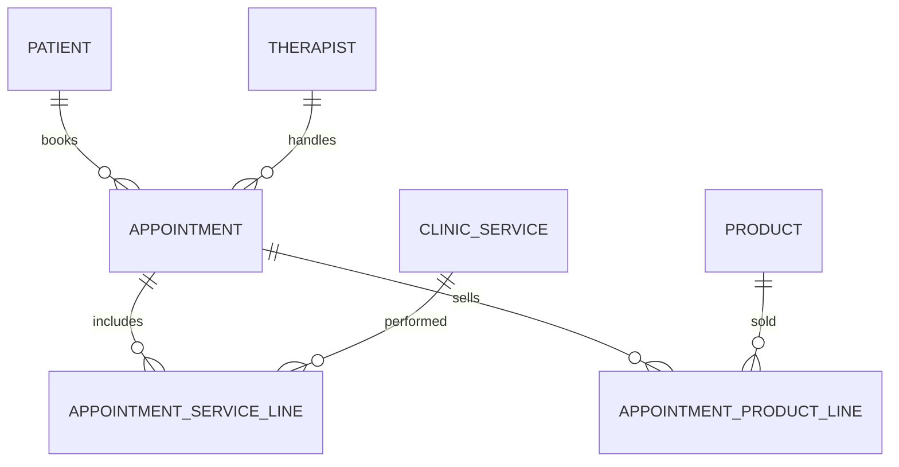

# Healing House Clinic Management System
## Requirements Document & Phased Implementation Guide

**Version:** 1.2 (Updated with Phase 2 completions and Phase 3 enhancements)  
**Date:** July 8, 2026  
**Clinic:** Healing House Clinic  
**Prepared by:** Grok (Senior Java Developer & Architect)  
**Purpose:** Provide a complete, actionable blueprint to build a fresh Spring Boot application for managing your clinic operations, appointments, patients, therapists, services, products, and therapist performance/perks.

### What's New in v1.2

**Tags System** (now primary categorization):
- Replaced fixed `category` fields on Services and Products with flexible **many-to-many Tag relationships**
- Services and Products can have multiple tags for better organization and reporting

**Per-Line Therapist Attribution** (critical for accurate commission):
- Each service/product line now has its own therapist assignment (defaults to appointment's main therapist but can differ)
- Commission is calculated per-line (each line attributed to its assigned therapist)
- Enables accurate tracking when multiple therapists work on same appointment

**Responsive Design** (cross-phase requirement):
- All pages must be mobile-friendly: 375px (mobile), 768px (tablet), 1920px (desktop)
- Forms, tables, navigation, and reports all responsive
- Bootstrap 5 utilities + custom CSS for mobile-first design

**Phase 3 Expanded** (comprehensive analytics & reporting):
- Multiple report types: Daily, Period, Therapist Comparison, Patient Acquisition, Product/Service Performance
- Advanced dashboards with KPI cards, charts, trends
- Export to CSV and PDF formats
- Per-line commission calculations reflected in all reports
- Responsive design on all dashboard and report pages

---

## Executive Summary

This document defines a **modern, clean, maintainable Spring Boot + Thymeleaf + MySQL** web application tailored specifically for **Healing House Clinic**.

The system will allow you (as Admin) to:
- Manage patients, therapists, service catalog, and herbal/natural product inventory.
- Schedule and record appointments with multiple services and products sold in one visit.
- Automatically track revenue, attribute sales to therapists, and calculate **fair therapist payouts** (fixed salary + commission on services/products + performance bonuses).
- Get powerful daily, weekly, and monthly views/reports showing exactly how many patients came, what they bought/did, who treated them, and how much each therapist earned in perks that day/month.

**Important Scope Decision (as requested):**
- **No login, no security, no roles in initial phases.** The entire application behaves as if you are the Admin with full access. We will add therapist logins, role-based access, and Spring Security **only after** the core functionality is complete and stable.
- Focus 100% on **core operational features** first.

The document is structured so you (or an AI coding assistant like Claude/Cursor/Windsurf) can implement it **step-by-step** with clear deliverables after each phase. You can literally say:  
> "Follow the Healing House Clinic Requirements v1.0 and implement **Phase 2 Step 2.3** now."

---

## 1. Business Context & Key Requirements

### What Healing House Clinic Offers
- **TCM-related therapies** (Traditional Chinese Medicine)
- Massages (various kinds)
- Acupuncture
- Ion therapy
- Detoxification services/programs
- Compression therapy ("Compressor")
- Other natural/holistic therapies
- Sale of **herbal products**, supplements, oils, teas, detox kits, etc.

### Core Business Rules You Described
- Every appointment involves **one primary therapist** who performed the work.
- The therapist gets:
  - **Fixed monthly salary** (base pay)
  - **Commission** (example: 10%) on the value of services performed **and** products sold during/through their appointments
  - **Performance bonus** (example: ₹5,000) if they cross a threshold (e.g., >100 massages/services in a month)
- You need visibility into:
  - Daily/weekly/monthly patient footfall + services taken + products bought
  - Revenue (services vs products)
  - Per-therapist earnings breakdown (so you know exactly what to pay as "perks" at month end)
- Simple admin workflow: Add/Edit/Delete everything, schedule/record appointments quickly, see insightful reports.

---

## 2. Assumptions (Clearly Stated)

1. **TCM** = Traditional Chinese Medicine. Services will have a flexible `category` field so you can tag "TCM", "Massage", "Hijama", "IonDetox", "Acupuncture", etc. All services are fully configurable via admin UI.
2. **One therapist per appointment** (the person who gets credit for commission/bonus). Multi-therapist appointments can be added later.
3. Product sales always happen **inside an appointment** (after consultation). No separate counter sales in core.
4. All money in **Indian Rupees (₹)**. Use `BigDecimal` everywhere for precision.
5. Status flow (simple for core): `SCHEDULED` → `COMPLETED` (or `CANCELLED` / `NO_SHOW`).
6. Stock is decremented **only when an appointment is marked COMPLETED** and products are included.
7. Bonus threshold is based on **number of services performed** (line items), not number of appointments. This matches your "100 massages" example.
8. Fixed salary is shown as reference in reports. Actual "payout" calculation focuses on **variable pay** (commission + bonus) earned in the selected period. You can adjust the business rule later.
9. No recurring appointments, treatment packages, or patient loyalty points in **core phase**.
10. UI must be usable on a tablet at reception desk (responsive Bootstrap).

If any assumption is wrong, reply with corrections and we will update this document + adjust the phases.

---

## 3. Clarifications Incorporated (from User Feedback - v1.1)

All points from the original questions have been addressed and integrated:
- PCM → **TCM (Traditional Chinese Medicine)**
- Services: Fully configurable by Admin. Examples include Acupuncture, Hijama, Deep Tissue Massage, Foot Ion Detox, etc. Appointments are general; exact treatments decided post-consultation and recorded via line items.
- Commission, bonus, and salary rules: **Per-therapist configurable** (different values supported).
- No pure counter sales — all product sales tied to appointments after consultation.
- Payment methods: CASH, UPI, BANK_TRANSFER, CARD, OTHER (as implemented in `PaymentMethod` enum).
- Patient: DOB (estimated from age on entry) with auto age calculation; other fields (allergies, medical history, ID proof, etc.) optional.
- Reports: Support **daily, weekly, monthly, and custom date ranges**.
- **Marcia Gomes Yadav** (owner/main therapist): Special handling — no salary or commission calculations.
- Development: Broken into very small, incremental stages to minimize bugs.
- No existing data import needed.

---

## 4. Technology Stack & Project Setup

## 4. Technology Stack & Project Setup

| Layer          | Technology                          | Version / Notes                     |
|----------------|-------------------------------------|-------------------------------------|
| Backend        | Spring Boot                         | Latest stable (3.3+ / 3.4+ as of 2026) |
| Web            | Spring MVC + Thymeleaf              | Thymeleaf 3.x                       |
| Database       | MySQL 8+                            | Local first                         |
| ORM            | Spring Data JPA + Hibernate         | ddl-auto=update initially           |
| Utilities      | Lombok, Jakarta Validation          | -                                   |
| Frontend       | Bootstrap 5.3 (CDN) + Vanilla JS    | Clean clinic theme (calming greens) |
| Charts         | Chart.js (CDN)                      | For dashboard & reports             |
| Build          | Maven                               | -                                   |
| Java           | 21                                   | As implemented                      |
| Migrations     | Hibernate `ddl-auto=update`         | Flyway not adopted; schema auto-managed by Hibernate (see `application.yml`). No migration files exist yet. |

> **As-built note:** the actual base package is `com.clinic.healinghouse` (not `com.healinghouse.clinic` as originally drafted below), and Spring Boot 4.1.0 is in use. Package layout otherwise matches the structure below.

**Recommended package structure:**
```
com.clinic.healinghouse
├── HealinghouseApplication.java
├── config/
├── controller/          (web controllers returning Thymeleaf views)
├── dto/                 (form DTOs, report DTOs)
├── entity/              (JPA entities + enums)
├── exception/           (@ControllerAdvice + custom exceptions)
├── repository/          (Spring Data JPA repos)
├── service/             (business logic + commission calculator)
├── util/                (formatters, date helpers)
└── resources/
    ├── templates/
    │   ├── fragments/   (layout, header, sidebar, alerts)
    │   ├── dashboard.html
    │   ├── patients/
    │   ├── therapists/
    │   ├── services/
    │   ├── products/
    │   ├── appointments/
    │   └── reports/
    ├── static/
    │   ├── css/
    │   ├── js/
    │   └── images/      (logo placeholder)
    └── db/migration/    (Flyway .sql files)
```

**Database name (local):** `healing_house_clinic`

---

## 5. Domain Model (Core Entities)

### Entity Relationship Overview (Mermaid - copy to any MD viewer)



> **As-built note:** entity class names differ slightly from the names below to avoid collisions with Spring's own `@Service` stereotype: `Service` → **`ClinicService`**, `AppointmentService` → **`AppointmentServiceLine`**, `AppointmentProduct` → **`AppointmentProductLine`**.

### Core Entities (Detailed)

**1. Patient**
- `id` (Long, PK, auto)
- `fullName` (String, required)
- `phone` (String, unique/index)
- `email` (String, optional)
- `gender` (Enum or String)
- `dateOfBirth` (LocalDate)
- `address` (String)
- `medicalHistory`, `allergies`, `notes` (Text)
- `active` (boolean, default true)
- `createdAt`, `updatedAt`

**2. Therapist**
- `id`
- `fullName` (e.g. "Marcia Gomes Yadav" is the owner/main therapist — special handling: **no salary or commission calculation** for her)
- `specialization` (e.g. "Massage Therapist", "Acupuncturist & Detox Specialist")
- `phone`, `email`
- `fixedMonthlySalary` (BigDecimal, null/0 for owner)
- `commissionRate` (BigDecimal, configurable, null/0 for owner; can differ per therapist)
- `performanceBonusThreshold` (Integer, configurable)
- `performanceBonusAmount` (BigDecimal, configurable)
- `notes`
- `active`
- `createdAt`, `updatedAt`

**Note:** Commission rules (rate, threshold, bonus amount) are fully configurable **per therapist**. Marcia Gomes Yadav (owner) has no salary/commission calculations. Future enhancement: per-therapy/product commission rates if needed.

**3. Tag** (Flexible Multi-Purpose Labels — replaces fixed categories)
- `id`
- `name` (String, required, unique case-insensitive; e.g. "Massage", "Detox", "TCM", "Acupuncture", "IonTherapy", etc.)
- `createdAt`, `updatedAt`
- **Relationships**: Many-to-Many with ClinicService and Product (via join tables `service_tag` and `product_tag`)

**4. ClinicService** (Treatment Catalog — named `ClinicService` to avoid clashing with Spring's `@Service`)
- `id`
- `name` (e.g. "Swedish Massage 60 min")
- `description`
- `tags` (Set<Tag>, many-to-many; replaces single `category` field)
- `durationMinutes` (Integer)
- `price` (BigDecimal)
- `active`

**5. Product** (Herbal & Natural Items)
- `id`
- `name`
- `description`
- `tags` (Set<Tag>, many-to-many; replaces single `category` field)
- `price` (BigDecimal)
- `stockQuantity` (Integer)
- `reorderLevel` (Integer, default 5)
- `active`

**5. Appointment**
- `id`
- `patient` (ManyToOne)
- `therapist` (ManyToOne)
- `appointmentDateTime` (LocalDateTime)
- `status` (Enum: SCHEDULED, COMPLETED, CANCELLED, NO_SHOW)
- `notes` (Text)
- `cancelReason` (String, set when status becomes CANCELLED)
- `totalServiceAmount`, `totalProductAmount`, `grandTotal`, `amountPaid` (BigDecimal)
- `paymentMethod` (Enum: CASH, UPI, BANK_TRANSFER, CARD, OTHER)
- `createdAt`, `completedAt`, `updatedAt`

**6. AppointmentServiceLine** (Line Item)
- `id`
- `appointment` (ManyToOne)
- `service` (ManyToOne → `ClinicService`)
- `therapist` (ManyToOne → `Therapist`) — **per-line therapist attribution** (defaults to appointment's main therapist but can differ)
- `priceAtTime` (BigDecimal)   // snapshot
- `quantity` (Integer, default 1)
- `lineTotal` (BigDecimal, calculated as `priceAtTime × quantity`)

**7. AppointmentProductLine** (Line Item)
- `id`
- `appointment` (ManyToOne)
- `product` (ManyToOne)
- `therapist` (ManyToOne → `Therapist`) — **per-line therapist attribution** (defaults to appointment's main therapist but can differ)
- `quantity` (Integer)
- `priceAtTime` (BigDecimal)
- `lineTotal` (BigDecimal, calculated as `priceAtTime × quantity`)

> **Design Note:** We use separate line-item entities so history is preserved even if catalog prices change later. Totals are calculated in service layer (not stored redundantly except for quick reporting).

---

## 6. Core Features (What Must Work)

### 6.1 Master Data (Full CRUD + Search)
- Patients (list + search by name/phone + view history link)
- Therapists (list + salary/commission/bonus config visible)
- Services (by category)
- Products (stock visible, low-stock highlighted)

### 6.2 Appointment Flow (Most Important)
- Create appointment form with:
  - Patient selector (dropdown + search)
  - Therapist selector
  - Date + Time (`datetime-local`)
  - Dynamic "Services performed" section (add multiple rows via JS, live price + total)
  - Dynamic "Products sold" section (add multiple, show current stock, warn if insufficient)
  - Notes
  - Payment section (method + amount paid)
- On save → persist lines, snapshot prices, calculate totals, **decrement stock**, link everything to the chosen therapist.
- List appointments (filter by date range, therapist, patient, status)
- Detail view + "Mark as Completed" action (if not already)
- Cancel with reason (soft)

### 6.3 Reports & Therapist Earnings (Your Key Ask)
**Daily View** (select any date):
- Total appointments, patients served, revenue split (services vs products)
- Per-therapist mini table: appts handled, services count, revenue generated, commission earned that day

**Daily / Weekly / Monthly / Custom Date Range View**:
- KPI cards + breakdown table per therapist:
  - Services Revenue | Products Revenue | Commission Earned (services + products × rate)
  - Services Performed Count | Bonus Earned? (Yes/No + amount)
  - **Total Variable Pay** for the period
- Reference: Fixed Monthly Salary shown for context
- Export to CSV button (for accountant)

**Commission Calculation Logic (Per-Line Attribution — to be implemented in service):**

For each therapist, calculate earnings from only the lines attributed to them:

```java
// Per therapist, sum revenue from their assigned lines
BigDecimal servicesRevenue = appointment.serviceLines
    .filter(line -> line.therapist.id == therapist.id)
    .sum(line -> line.lineTotal);
    
BigDecimal productsRevenue = appointment.productLines
    .filter(line -> line.therapist.id == therapist.id)
    .sum(line -> line.lineTotal);

// Commission on services and products
BigDecimal serviceCommission = servicesRevenue.multiply(therapist.getCommissionRate());
BigDecimal productCommission = productsRevenue.multiply(therapist.getCommissionRate());
BigDecimal totalCommission = serviceCommission.add(productCommission);

// Count of services performed by this therapist
int servicesCount = appointment.serviceLines
    .filter(line -> line.therapist.id == therapist.id)
    .size();

// Bonus if threshold met (based on therapist's service count in period)
BigDecimal bonus = BigDecimal.ZERO;
if (totalServicesPerformedCount >= therapist.getPerformanceBonusThreshold()) {
    bonus = therapist.getPerformanceBonusAmount();
}

// Total variable pay
BigDecimal totalVariablePay = totalCommission.add(bonus);
```

**Key Change:** Commission is now attributed **per-line by the therapist assigned to that line**, not by appointment's main therapist. This enables accurate tracking when different therapists perform different services/products in the same appointment.

### 6.4 Dashboard (Home Page)
- Today's appointments (quick list)
- KPI cards: Today's appts, This month's revenue, Low stock items, Active therapists
- Mini charts: Last 7/30 days revenue trend + Revenue by category pie
- Quick action buttons: New Appointment, New Patient, View Reports

---

## 7. Phased Implementation Roadmap (Ready for AI Coding)

Each phase ends with a **working, testable increment**. Use the exact phase/step numbers when prompting your coding assistant.

### Phase 0: Project Bootstrap (Run this first) — Small incremental stage

**Step 0.1** — Generate project at [start.spring.io](https://start.spring.io)
- Maven + Java 21 + Spring Boot latest stable
- Dependencies: **Spring Web, Thymeleaf, Spring Data JPA, MySQL Driver, Lombok, Validation, DevTools**

**Step 0.2** — Create local MySQL database:
```sql
CREATE DATABASE healing_house_clinic 
  CHARACTER SET utf8mb4 COLLATE utf8mb4_unicode_ci;

CREATE USER 'clinic_user'@'localhost' IDENTIFIED BY 'StrongPass123!';
GRANT ALL ON healing_house_clinic.* TO 'clinic_user'@'localhost';
FLUSH PRIVILEGES;
```

**Step 0.3** — Configure `application.yml` (or `.properties`) with datasource, `ddl-auto: update`, `show-sql: true`, Thymeleaf cache false for dev.

**Step 0.4** — Create package structure + a basic `HomeController` returning a placeholder dashboard with navigation links to all future sections (Patients, Therapists, Services, Products, Appointments, Reports).

**Step 0.5** — Add a simple `fragments/layout.html` (header with clinic name "Healing House Clinic", nav, footer). Make home page use the layout.

**Deliverable:** Application starts cleanly on `http://localhost:8080`, shows nice header/nav, connects to your local MySQL without errors.

---

### Phase 1: Master Data – Patients, Therapists, Services, Products, Tags

**Step 1.1** — Create all **Entity** classes + Enums (`AppointmentStatus`, `PaymentMethod`) with proper JPA, Lombok (`@Data`, `@Builder` where safe), `@CreationTimestamp`/`@UpdateTimestamp`, `active` flags, and sensible indexes.
- Include **Tag** entity with many-to-many relationships to ClinicService and Product

**Step 1.2** — Create **Repository** interfaces (extend `JpaRepository`). Add useful query methods (`findByActiveTrue()`, `findByPhoneContainingIgnoreCase`, `findByFullNameContainingIgnoreCase`, etc.).

**Step 1.3** — Create **Service** classes (e.g. `PatientService`, `TherapistService`) with CRUD methods + search. Use `@Transactional` where appropriate.

**Step 1.4** — Create **Controllers + Thymeleaf views** for:
- Patients (list table + search form + create/edit form with validation)
- Therapists (show salary, commission rate nicely formatted, bonus config)
- **Tags** (create, list, rename, merge, delete with usage counts)
- Services (tag multi-select/chip input instead of category dropdown)
- Products (tag multi-select/chip input, stock column + low stock warning in red)

Use Bootstrap 5 tables, forms, modals for delete confirmation. Add flash messages (`RedirectAttributes`). Make all pages responsive for mobile/tablet.

**Step 1.5** — Create `DataSeeder` (implements `CommandLineRunner`) that populates realistic sample data **only if tables are empty** on first run:
- Several Patients (with DOB estimates)
- 3–4 Therapists (include Marcia Gomes Yadav as owner with salary=0, commission=0; others with configurable values)
- 8–10 Services (TCM, Acupuncture, Hijama, Deep Tissue Massage, Foot Ion Detox, etc.)
- 6–8 Products with varying stock levels

**Deliverable Phase 1:** You can fully manage (add/edit/deactivate/search) all master data through a clean UI. Sample data is there for testing. No broken pages.

---

### Phase 2: Appointment Management & Line Items (Core Workflow)

**Step 2.1** — Implement `Appointment`, `AppointmentServiceLine`, `AppointmentProductLine` entities + repositories. Add proper relationships (ManyToOne with `FetchType.LAZY`).
- **Important:** Each line item (service/product) has its own `therapist` field for per-line attribution in commission calculations

**Step 2.2** — Create `AppointmentService.java` (business logic) with methods:
- `createAppointment(...)` — handles validation, price snapshots, total calculation, stock decrement, persistence, **per-line therapist assignment**
- `findByFilters(...)`
- `markAsCompleted(Long id)`
- `cancelAppointment(id, reason)` — restores product stock on cancel
- `markAsNoShow(Long id)` — restores product stock (as-built addition beyond original spec)
- `updateAppointment(id, form)` — full edit for SCHEDULED appointments, incl. per-line therapist reassignment, re-snapshotting lines and stock adjustment
- **Important:** All calculations now use per-line therapist attribution (line's therapist, not appointment's main therapist)

**Step 2.3** — Build the **Appointment creation form** (most complex UI):
- Patient & Main Therapist selects
- `datetime-local` input
- **Dynamic Services section** (JS-powered "Add Service" button that appends a row with service `<select>`, **per-line therapist `<select>`** (defaults to main therapist), auto-fills price, live subtotal, remove button). Client-side total calculation.
- **Dynamic Products section** (same pattern: product `<select>`, **per-line therapist `<select>`**, quantity, current stock display + warning if qty > stock)
- Notes + Payment method + Amount paid
- Big live "Grand Total" display (grouped by assigned therapist for clarity)
- On submit: send data to controller including per-line therapist assignments
- **Responsive design**: Form must be usable on mobile (375px), tablet (768px), and desktop (1920px)

**Step 2.4** — Appointment list page with server-side filters (date range, therapist, status, patient name). Table shows key info + action buttons (View, Cancel, Complete).

**Step 2.5** — Appointment detail page (nice cards showing patient info, therapist, all line items in tables, totals, payment info, status actions).

**Deliverable Phase 2:** Complete end-to-end appointment flow works. Multiple services + products per appointment, stock updates correctly, everything attributed to the chosen therapist. List + detail views are usable.

---

### Phase 3: Dashboard + Reports + Analytics + Therapist Earnings Calculation

**Step 3.1** — Create core analytics services:
- `CommissionCalculator` — calculates per-line commission/bonus using per-therapist, per-line attribution
- `ReportService` — queries appointments, aggregates by therapist/tag/period
- `DashboardService` — KPI calculations and data preparation
- `AnalyticsService` — trends, comparisons, product/service performance

Implement exact calculation logic from section 6.3 (per-line attribution).

**Step 3.2** — Build **Dashboard** (`/`) — Mobile & Desktop Responsive:
- **KPI Cards** (stacked on mobile, 4-col on desktop):
  - Today's appointments count
  - Today's revenue (₹)
  - Low stock items count
  - Active therapists count
- **Today's Appointments List** (scrollable table on mobile, normal on desktop)
- **Low Stock Alerts** (collapsible on mobile)
- **Revenue Trend Chart** (Last 30 days; responsive Chart.js)
- **Revenue by Tag Breakdown** (Pie/Donut chart; touch-friendly on mobile)
- **Quick Action Buttons** (New Appointment, New Patient, View Reports)

**Step 3.3** — Build **Reports Section** with multiple views:

**3.3.1 Daily Report** (`/reports/daily`):
- Date picker input
- Summary cards: Total appointments, Total revenue (services vs products), New patients, Repeat patients
- **Per-Therapist Earnings Table**:
  - Therapist name
  - Services performed count
  - Services revenue (₹)
  - Products revenue (₹)
  - Commission earned (₹)
  - Bonus earned (Y/N + amount)
  - **Total Variable Pay** (commission + bonus)
  - Reference: Fixed salary (read-only)
- Drill-down option: Click therapist → see detailed line items for that day

**3.3.2 Period Report** (`/reports/period`):
- Date range form (From date, To date)
- Period summary: Total appointments, New vs repeat patients, Total revenue split
- **Per-Therapist Detailed Earnings**:
  - All columns from daily report (services count, revenue, commission, bonus)
  - Session count (how many appointments)
  - Average revenue per appointment
  - Performance against bonus threshold
- **Tag-Based Revenue Breakdown** table:
  - Tag name
  - Service count with this tag
  - Revenue from this tag (by therapist if needed)
  - Top performers for this tag
- **Product Performance Table**:
  - Product name
  - Quantity sold
  - Total revenue
  - Profit margin (if cost tracked, otherwise just revenue)
  - Top selling therapist for this product

**3.3.3 Therapist Comparison Report** (`/reports/comparison`):
- Multi-select therapist picker (compare 2-3 therapists)
- Date range
- **Side-by-side comparison table**:
  - Appointments count
  - Services count
  - Total revenue (services + products)
  - Commission earned
  - Bonus earned
  - Average revenue per appointment
  - % of total clinic revenue
- Performance differential (who's ahead by how much)
- Charts: Stacked bar (revenue comparison), Line (trend comparison)

**3.3.4 Patient Acquisition & Retention Report** (`/reports/patients`):
- Date range
- Summary: Total new patients, Repeat patients, Return rate (%)
- **Per-Therapist Patient Metrics**:
  - Therapist name
  - New patients acquired
  - Repeat patients (returning for 2nd+ appointment)
  - Retention rate (repeat / total)
  - Patient satisfaction (if tracked, else blank for now)
- **Patient Trend Chart**: New vs repeat patients over time (line chart)

**3.3.5 Product & Service Performance Report** (`/reports/performance`):
- Date range
- **Service Performance Table**:
  - Service name
  - Tags (display all tags for this service)
  - Count (how many times performed)
  - Total revenue
  - Average price realized
  - Top therapist for this service
  - Performance trend (up/down vs prior period)
- **Product Performance Table**:
  - Product name
  - Tags
  - Units sold
  - Total revenue
  - Stock level
  - Reorder priority (if units < reorder level)
  - Days supply remaining (units / avg daily sales)
- **Tag-Based Revenue Breakdown** (cross-tab: tags × therapists × revenue)

**Step 3.4** — Export & Analytics Features:
- **CSV Export** for all reports (download button on each report)
- **PDF Export** (using iText or similar) — formatted report document with:
  - Header: Clinic name, report name, date range
  - All tables and summaries from the report
  - Footer: Generated date, disclaimer
- **Print-friendly view** — optimized CSS for printing
- Each report has Download CSV & Download PDF buttons

**Step 3.5** — Responsive Design & Mobile Optimization:
- All reports and dashboard optimized for mobile-first design
- Tables collapse to card view on mobile (each row becomes a card)
- Charts responsive (Chart.js default responsive behavior)
- Navigation: Hamburger menu on mobile, full nav on desktop
- KPI cards stack vertically on mobile, horizontal on desktop
- Date pickers work on mobile/tablet
- **Touch-friendly**: All buttons ≥44px, proper spacing

**Step 3.6** — Data Visualization Enhancements:
- **Revenue Trend Chart** (Line chart): Daily revenue over period, with therapist breakdown (stacked area or multiple lines)
- **Tag-Based Revenue** (Pie/Donut): Revenue split by tag for period
- **Therapist Comparison** (Bar chart): Revenue per therapist side-by-side
- **Product Sales Velocity** (Bar chart): Top 10 products by revenue
- **Service Popularity** (Bar chart): Top 10 services by count
- **Patient Acquisition Trend** (Area chart): New patients over time
- All charts: Hover tooltips, responsive, legend toggleable

**Deliverable Phase 3:** Complete analytics & reporting suite. You can:
- See per-therapist earnings attributed accurately (per-line commission)
- Compare therapist performance in detail
- Understand service/product performance by tag
- Track patient acquisition and retention
- Export reports in CSV and PDF for accounting/analysis
- View all dashboards and reports on mobile, tablet, and desktop with proper responsive design
- Make data-driven decisions about therapist compensation, service/product focus, and clinic growth

---

### Phase 4: Polish, Testing, Documentation & Performance Optimization

**Step 4.1** — Consistent layout using Thymeleaf fragments (header, sidebar nav, footer, alert messages, confirmation modals, responsive navbar).

**Step 4.2** — UX/Polish enhancements:
- ✅ **Responsive design** (completed in Phases 2-3; now verify all pages work on mobile 375px, tablet 768px, desktop 1920px)
- Client-side form enhancements (better dynamic rows, live total update, validation feedback)
- Date/Currency formatting (consistent ₹ symbols, date format "DD MMM YYYY", nice readable timestamps)
- Success/error toasts or Bootstrap alerts with auto-dismiss
- Quick search on list pages (Patients, Therapists, Services, Products)
- Loading indicators on long-running reports
- Empty state messaging (no data → helpful prompts)

**Step 4.3** — Database optimization:
- Add indexes on high-query columns: `appointmentDateTime`, `createdAt`, `therapistId`, `patientId`, `status`
- Foreign key indexes for relationships
- Analyze query performance on large datasets (simulate 1000+ appointments)

**Step 4.4** — Testing & Quality:
- Unit tests for `CommissionCalculator` (per-line attribution, bonus logic)
- Unit tests for `ReportService` (filtering, aggregation)
- Integration tests for key flows (create appointment → calculate commission)
- Browser testing: Chrome, Firefox, Safari on mobile and desktop
- Accessibility audit: WCAG 2.1 AA compliance (keyboard nav, screen reader compatibility)

**Step 4.5** — Documentation & Deployment:
- Update `README.md` with:
  - Setup instructions (DB creation, Spring Boot run)
  - Screenshots of key features
  - User guide (how to create appointment, run reports)
  - Admin guide (managing therapists, products, tags)
  - Future roadmap (Phase 5 security, etc.)
- Add code comments on complex business logic
- API documentation (if REST endpoints added)
- Database schema documentation

**Step 4.6** — Performance & Monitoring:
- Query optimization (use lazy loading properly, add pagination for large lists)
- Caching where beneficial (e.g., therapist list for dropdowns)
- Response time targets: Page load < 2s, Report generation < 5s
- Error handling: User-friendly error messages, no stack traces visible to user

**Deliverable Phase 4:** Production-ready, polished internal tool. All core functionality complete, well-tested, fully responsive, and documented. Ready for daily clinic use and confident for future enhancements.

---

## 8. Future Roadmap (After Core is Done)

1. **Phase 5** — Spring Security + User management
   - Admin full access
   - Therapist login → own schedule + own earnings dashboard only
2. **Phase 6** — PDF invoice / receipt generation + email/SMS reminders (optional)
3. **Phase 7** — Advanced features (treatment packages, recurring appts, detailed patient visit notes history, GST invoices, multi-location)
4. Docker + production deployment guide

---

## 9. How to Use This Document with AI Coding Assistants

1. Keep this file in your project root or share the relevant section.
2. Start a new chat/session with your AI (Claude, Cursor, etc.).
3. Paste the **Executive Summary + the exact Phase + Step** you want.
4. Example prompt:
   ```
   You are a senior Spring Boot developer. Follow the "Healing House Clinic Requirements Document v1.0" exactly.

   Implement Phase 1 Step 1.4 and Step 1.5:
   - Create clean Thymeleaf + Bootstrap UI for Patients and Therapists CRUD.
   - Add realistic DataSeeder for first run.
   - Use proper validation and flash messages.
   - Make sure everything follows the entity design in section 5.

   After finishing, give me a summary of what was created and any files I should review.
   ```
5. Review the code, test in browser, then say "Good, now do Phase 2 Step 2.3" or give specific feedback for fixes.

This phased approach minimizes context loss and keeps the project clean and on track.

---

## 10. Getting Started Right Now

1. Reply with answers to the **Open Questions** (section 3) if you have any changes.
2. Create the folder `healing-house-clinic` and run **Phase 0 Step 0.1 – 0.5**.
3. Once Phase 0 is done and the app runs, come back and say:  
   **"Phase 0 complete. Let's start Phase 1."**

I will then guide you (or generate the exact code) for the next steps.

---

**This system will give you full control and transparency over your clinic operations and therapist compensation — exactly as you described.**

Ready when you are. Let's build it step by step.

---

*Document Version 1.0 – Healing House Clinic – June 2026*